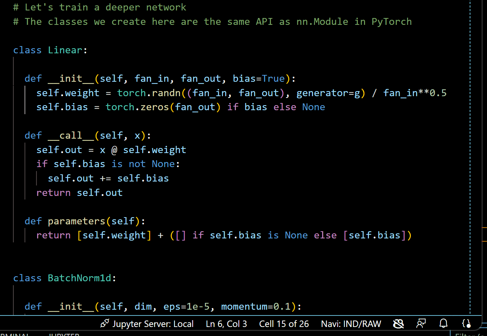
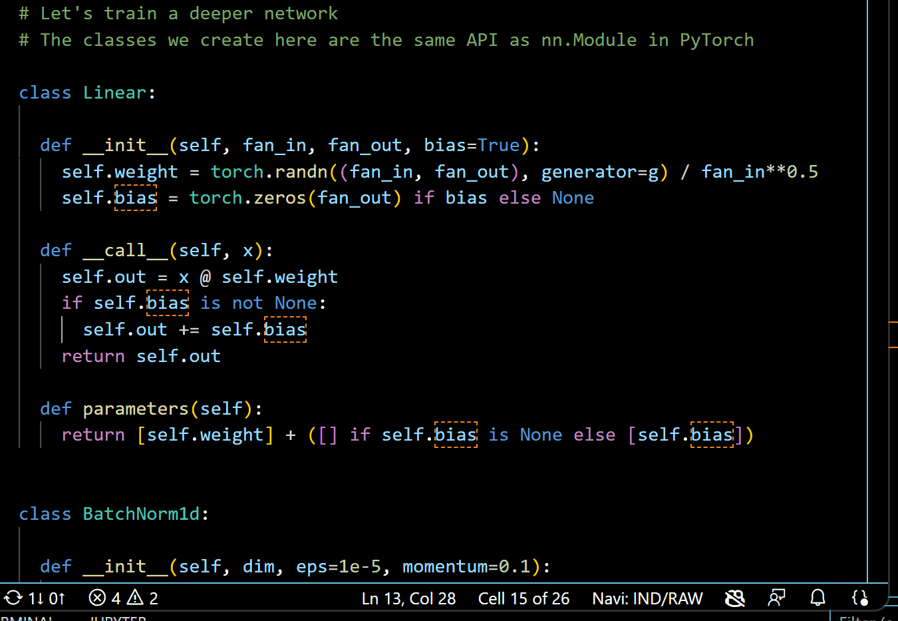
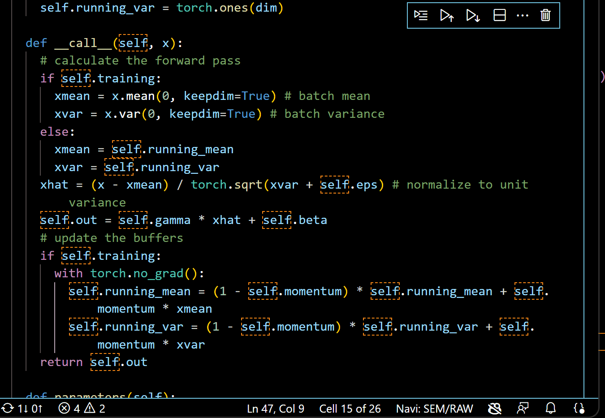
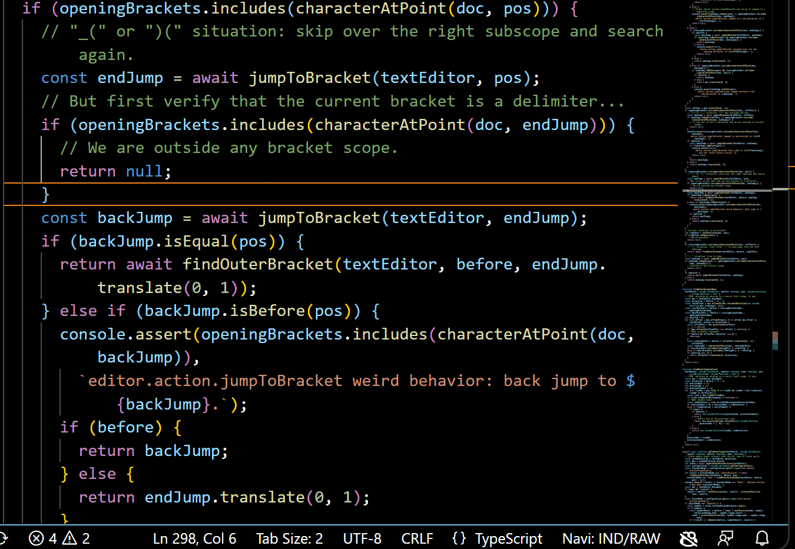
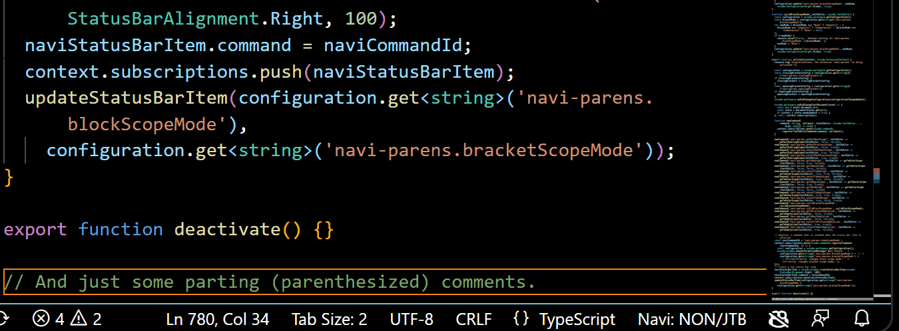
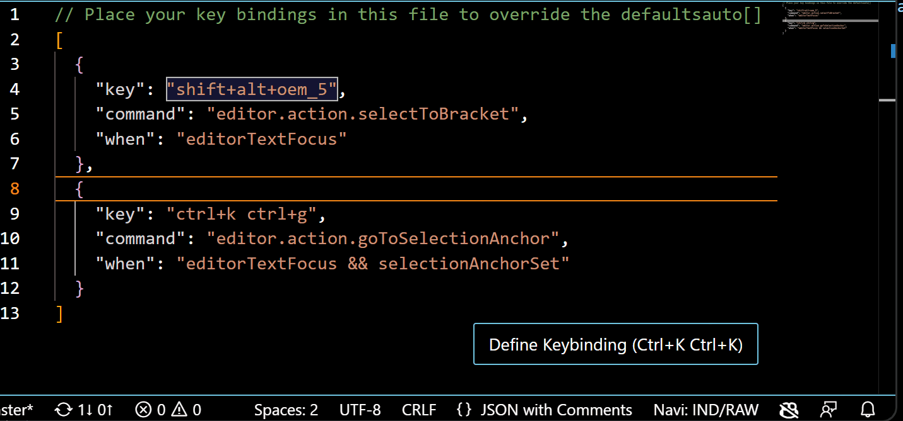

# navi-parens README

Navi Parens is a Visual Studio Code extension that provides structured code navigation similar to what's available in Emacs.
It also provides additional key bindings for moving the cursor without "fingers leaving the home row".

## Keywords

VSCode, Emacs, Structured Code Navigation, Home Row Cursor Movement

## Features

Commands:
* `goPastNextScope`: `ctrl+alt+l` Go past the next same-level closing bracket/scope
* `goPastPreviousScope`: `ctrl+alt+j` Go to the previous same-level opening bracket/scope
* `goToUpScope`: `ctrl+alt+i` Go outside the opening of the current level
* `goToDownScope`: `ctrl+alt+k` Go outside the closing of the current level
* `goToBeginScope`: `ctrl+alt+a` Go near the opening of the current level but stay inside scope
* `goToEndScope`: `ctrl+alt+k` Go near the closing of the current level but stay inside scope
* `goToPreviousEmptyLine`: `ctrl+alt+h` Go to the previous line with only whitespace (or empty)
* `goToNextEmptyLine`: `ctrl+alt+;` Go to the next line with only whitespace (or empty)
* `selectToNextScope`: `shift+ctrl+alt+l` Select past the next same-level closing bracket/scope
* `selectToPreviousScope`: `shift+ctrl+alt+j` Select to the previous same-level opening bracket/scope
* `selectToUpScope`: `shift+ctrl+alt+i` Select till outside the opening of the current level
* `selectToDownScope`: `shift+ctrl+alt+k` Select till outside the closing of the current level
* `selectToBeginScope`: `shift+ctrl+alt+a` Select to near the opening of the current level but stay inside scope
* `selectToEndScope`: `shift+ctrl+alt+k` Select to near the closing of the current level but stay inside scope
* `selectToPreviousEmptyLine`: `shift+ctrl+alt+h` Select to the previous line with only whitespace (or empty)
* `selectToNextEmptyLine`: `shift+ctrl+alt+;` Select to the next line with only whitespace (or empty)
* `cycleBracketScopeMode`: `ctrl+alt+p` Cycle through the bracket scope logic (`ctrl+shift+\`, delimiter counting, none)
* `cycleBlockScopeMode`: `shift+ctrl+alt+p` Cycle through block scope logic (symbols, indentation, none)

The meaning of "near the beginning/end of a scope" is mode-specific.

Extra key bindings:
* `insertCursorAtEndOfEachLineSelected`: rebound from `shift+alt+i` to `shift+alt+p`
* `cursorRight`: `alt+l`
* `cursorLeft`: `alt+j`
* `cursorUp`, `list.focusUp`, `selectPrevCodeAction`, `selectPrevSuggestion`, `selectPrevParameterHint`: `alt+i`
* `cursorDown`, `list.focusDown`, `selectNextCodeAction`, `selectNextSuggestion`, `selectNextParameterHint`: `alt+k`
* `cursorHome`: `alt+a`
* `cursorEnd`: `alt+e`
* `cursorWordLeft`: `alt+h`
* `cursorWordEndRight`: `alt+;`
* `cursorRightSelect`: `shift+alt+l`
* `cursorLeftSelect`: `shift+alt+j`
* `cursorUpSelect`: `shift+alt+i`
* `cursorDownSelect`: `shift+alt+k`
* `cursorHomeSelect`: `shift+alt+a`
* `cursorEndSelect`: `shift+alt+e`
* `cursorWordLeftSelect`: `shift+alt+h`
* `cursorWordEndRightSelect`: `shift+alt+;`
* `deleteRight`: `alt+d`
* `deleteWordRight`: `ctrl+alt+d`

Navi Parens combines two sources of structure information:
* Brackets, braces, parentheses.
* Code blocks.

Each of the sources comes in two variants.
* The bracket scopes come from either a judicious use of the built-in `Go to Bracket` command, or just looking for the delimiter characters.
* The block scopes come from either semantic symbol providers, as in the outline view, where the corresponding scope is the full range of a definition; or from indentation.

An indentation scope comprises a less-indented line followed by at least one more-indented line.

The `Raw` mode for bracket scopes is useful for navigating within comments or string literals, and does not cause "jitter" like the `JumpToBracket` mode does. However, it is less reliable since it will count brackets even if they were not intended as delimiters.

## Some use cases

First Navi Parens-specific command activates the scope navigation modes indicator.

Navigation with `Semantic` mode.

Navigation with `Indentation` mode.

Navigation with `Jump To Bracket` with block modes disabled.

Navigation with `Raw` bracket mode.

## Extension Settings

This extension contributes the following settings:

* `navi-parens.rebind`: How to deal with the `shift+alt+i` binding conflict.
** Defaults to `true`.
** If `true`:
*** rebind `insertCursorAtEndOfEachLineSelected` from `shift+alt+i` to `shift+alt+p`
*** bind `cursorUpSelect` to `shift+alt+i`
*** do not make bindings for `ctrl+alt+o`.
** If `false`:
*** bind `cursorUpSelect` to `ctrl+shift+alt+o`
*** bind `cursorUp` to both `alt+i` and `ctrl+alt+o`.
* `navi-parens.blockScopeMode`: an enum selecting where the non-bracket structure information comes from.
** `Semantic`: the semantic analyzers integrated with VSCode. The default.
** `Indentation`: Navi Parens constructs symbols based on indentation. Details below.
** `None`: same behavior as if there were no symbol definitions in text.
** `ctrl+shift+alt+p` toggles between `Semantic` and `Indentation`.
* `navi-parens.bracketScopeMode`: an enum selecting how to get the bracket structure information.
** `JumpToBracket`: uses `editor.action.jumpToBracket` (i.e. `ctrl+shift+\`). The default.
** `Raw`: only the bracket characters are considered, without context.
** `ctrl+shift+alt+p` toggles between `Semantic` and `Raw`.
* `navi-parens.closingBrackets`: the superset of supported closing delimiters.
** Defaults to `[")", "]", "}", ">"]`.
** Can be language specific.
* `navi-parens.openingBrackets`: the superset of supported opening delimiters.
** Defaults to `["(", "[", "{", "<"]`.
** Can be language specific.
* `navi-parens.closingBracketsForRaw`: the closing delimiters for `bracketScopeProvider.Raw`.
** Defaults to `[")", "]", "}"]`.
** Can be language specific.
* `navi-parens.openingBracketsForRaw`: the opening delimiters for `bracketScopeProvider.Raw`.
** Defaults to `["(", "[", "{"]`.
** Can be language specific.

## Quirks, Technical Details and Known Issues

Currently, multiple cursors are not supported.

I ignore defined-symbols that are out-of-order with respect to the syntactic structure, e.g. Python class field definitions inside methods.

Currently, navigating scopes with multicharacter closing brackets might not work well.

If Navi Parens logs assertion failure, maybe the language has delimiters other than those in the configuration.

When navigating down out of a scope with both indentation and bracket scopes enabled, where the scope brackets are both the first non-white characters on their lines (as often happens with braces in JSON files), the behavior can be a bit unintuitive: the cursor can end up before the closing bracket/brace. That is because we jump out of the indentation scope, since it is contained (not just overlapping) in the brackets scope. We remain within the brackets scope. It is the intended behavior.

Some Navi Parens commands will misbehave if they are executed before a document editor is fully initialized. Specifically, the `Semantic` and `JumpToBrackets` modes require the corresponding initializations, while the `Indentation` and `Raw` modes are good-to-go right away since they only look at the text of a document.

As of v0.9.9, the indentation scope logic is not tailored for code mixing tab characters and spaces.

## Notes from a former Emacser

Coming from Emacs, I appreciate and suggest:
* Using the Breadcrumbs navigation (semantic outline) on top of editors.
* Using the Go Forward `alt+right arrow` and Go Back `alt+left arrow`.
* Mapping `Caps Lock` to `alt` (rather than `ctrl`) to facilitate using the above bindings.

## Release Notes

See the changelog file for a detailed list of features and changes!

### 0.9

Initial release of Navi Parens. The main missing features are multiple cursors support and multicharacter delimiters support.

### 0.9.9

* Bug fixes, yay! And simpler code.
* When the block scope and the brackets scope are non-containing overlapping, consistently prefer the farther-out target position.
* Optimization: don't invalidate Jump-To-Bracket cache on block mode change.
* More Emacs-inspired key bindings: delete `alt+d`, delete word `ctrl+alt+d`.

## Planned Releases

### 1.0.0

* Emacs functionality: recenter the view (middle-to-cursor, top-to-cursor, bottom-to-cursor) `alt+.`.
* Make the Navi-Parens-bound "move past next/previous word" consistently move past an alphanumeric word, rather than using the built-in `ctrl+rightArrow` / `ctrl+leftArrow` functionality.
* Add more tests.

### 1.1

Multicharacter delimiters support.

### 2.0

Multiple cursors support.